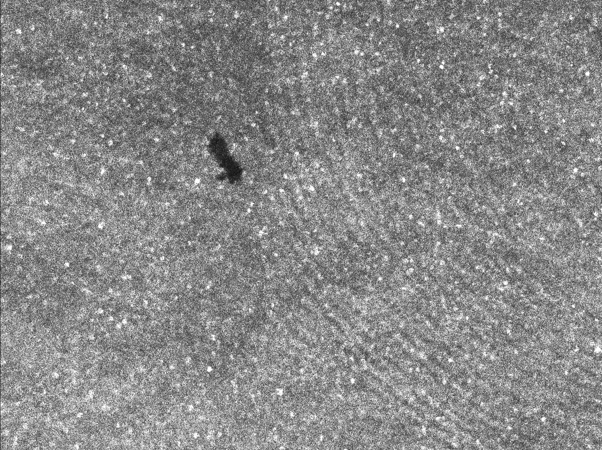
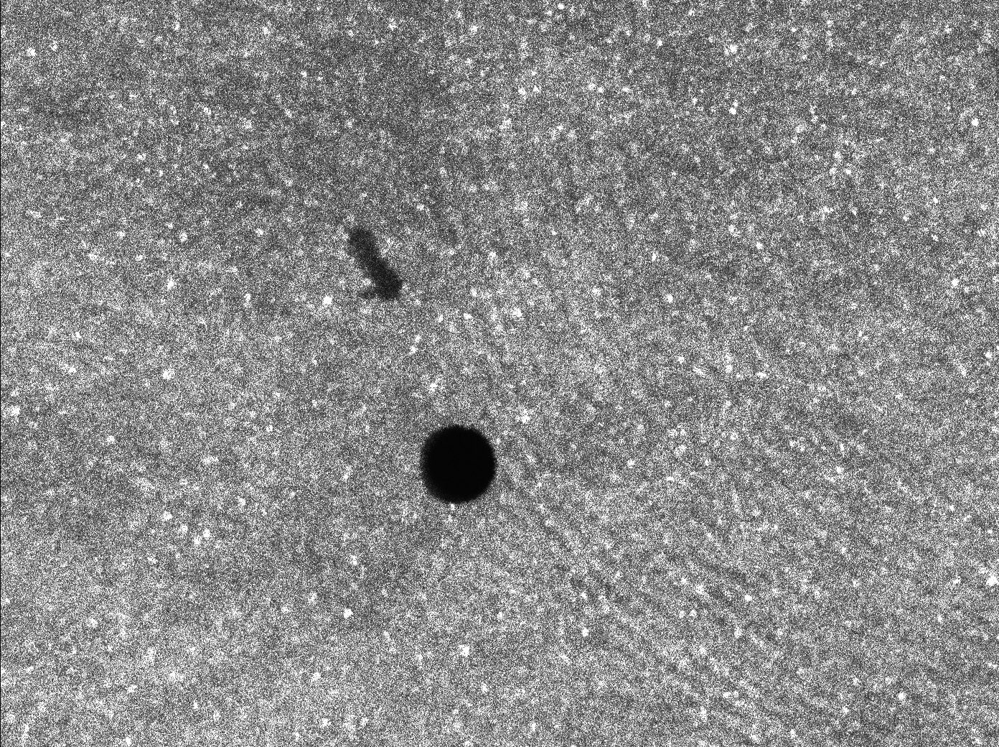
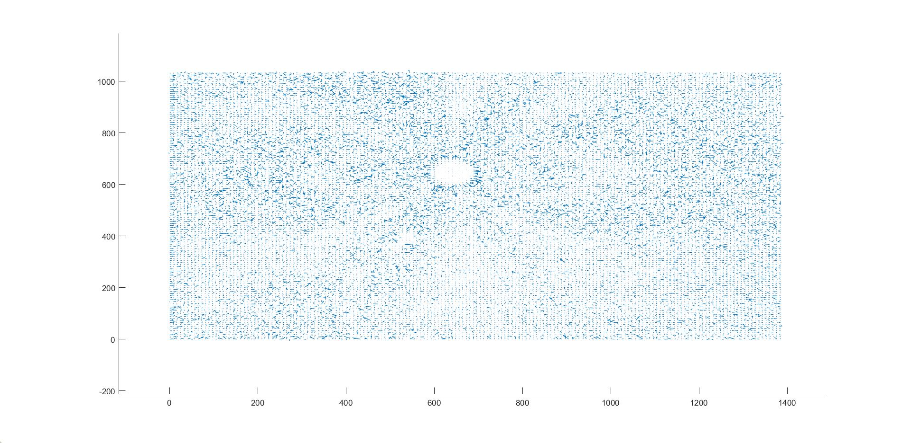

## Построение поля деформации материала

Программа для построения векторного поля деформации материала по экспериментальным изображениям.

##### Пример результата:

До деформации:

После деформации:

Векторное поле деформации:

